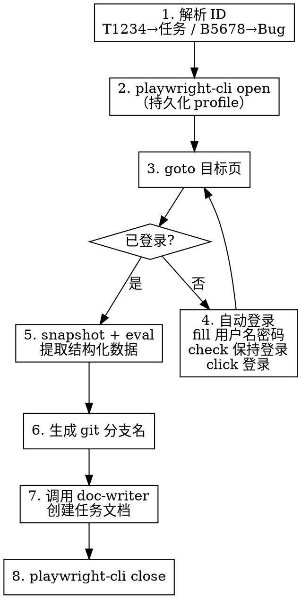

# zentao-syncer 重构实施计划

> **For Claude:** REQUIRED SUB-SKILL: Use superpowers:executing-plans to implement this plan task-by-task.

**Goal:** 用 playwright-cli 命令序列替代旧的 JS 脚本，重写 zentao-syncer skill，解决登录持久化问题。

**Architecture:** 删除 zentao-scraper.js 脚本和 zentao-sync 命令，重写 SKILL.md 为纯 playwright-cli 指令驱动。skill 通过关键词自动触发，使用 playwright-cli 持久化 profile 保持登录态，用 eval/run-code 提取页面数据，最终调用 doc-writer 生成知识库文档。

**Tech Stack:** playwright-cli (CLI), Obsidian Markdown, Claude Code skill/command 体系

---

### Task 1: 删除旧文件

**Files:**
- Delete: `skills/zentao-syncer/scripts/zentao-scraper.js`
- Delete: `commands/zentao-sync.md`

**Step 1: 删除脚本文件**

```bash
rm skills/zentao-syncer/scripts/zentao-scraper.js
rmdir skills/zentao-syncer/scripts
```

**Step 2: 删除命令文件**

```bash
rm commands/zentao-sync.md
```

**Step 3: 确认删除结果**

Run: `ls skills/zentao-syncer/` 和 `ls commands/`
Expected: scripts 目录不存在，commands 下无 zentao-sync.md

**Step 4: Commit**

```bash
git add -u
git commit -m "chore: 删除 zentao-syncer 旧脚本和 zentao-sync 命令 #0000"
```

---

### Task 2: 重写 SKILL.md — frontmatter 和基础结构

**Files:**
- Modify: `skills/zentao-syncer/SKILL.md`（完全重写）

**Step 1: 重写 SKILL.md**

将 SKILL.md 完全替换为以下内容：

```markdown
---
name: zentao-syncer
description: "Use when syncing tasks or bugs from Zentao to Knowledge Library - 同步禅道、禅道任务、禅道Bug、zentao sync、T1234、B5678、同步任务、同步Bug"
---

# 禅道任务同步

## Overview

从禅道抓取任务/Bug 详情，通过 playwright-cli 浏览器自动化访问禅道页面，提取结构化数据，自动创建符合规范的任务文档到知识库。

## When to Use

- 用户提到"同步禅道任务/Bug"
- 用户给出禅道 ID（如 T1234、B5678）
- 需要将禅道任务导入知识库开始开发时

## Quick Reference

**ID 格式：**

| 输入 | 类型 | URL 路径 |
|------|------|----------|
| T1234 | 任务 | task-view-1234.html |
| B5678 | Bug | bug-view-5678.html |

**禅道地址：** `https://chandao.bytenew.com/zentao/`

**输出位置：** `~/workspace/Knowledge-Library/02-Tasks/yyyyMMdd-{ID}-{标题}.md`

## 执行流程



## playwright-cli 命令序列

### 第一步：打开浏览器并访问目标页

```bash
# 打开浏览器（持久化 profile，保持登录态）
playwright-cli open

# 导航到目标页
playwright-cli goto https://chandao.bytenew.com/zentao/{type}-view-{id}.html

# 获取快照检查状态
playwright-cli snapshot
```

### 第二步：登录检测与处理

检查 snapshot 输出：
- 若页面 URL 包含 `user-login` 或 title 包含 `用户登录` → 需要登录
- 否则 → 已登录，跳到第三步

**自动登录命令序列：**

```bash
# 前置条件：需要环境变量 ZENTAO_USER 和 ZENTAO_PASSWORD
playwright-cli goto https://chandao.bytenew.com/zentao/user-login.html

# 获取快照确认登录表单已加载
playwright-cli snapshot

# 填入凭据（ref 可能变化，根据 snapshot 确认）
playwright-cli fill <用户名输入框ref> "$ZENTAO_USER"
playwright-cli fill <密码输入框ref> "$ZENTAO_PASSWORD"

# 勾选"保持登录"
playwright-cli check <保持登录checkbox-ref>

# 点击登录
playwright-cli click <登录按钮ref>

# 验证登录成功：检查 URL 不再包含 user-login
playwright-cli snapshot
```

**登录表单已知结构（供参考，ref 每次会变）：**
- 用户名输入框：`textbox` in row "用户名"
- 密码输入框：`textbox` in row "密码"
- 保持登录：`checkbox " 保持登录"`
- 登录按钮：`button "登录"`

### 第三步：提取数据

禅道使用双层 iframe 结构，snapshot 自动穿透。根据 snapshot 中的 ref 识别字段位置。

**Bug 页面关键字段位置（基于实际探索 Bug #49622）：**
- 标题：header 区域，格式为 `generic: "{id}"` + `text: 标题内容`
- 基本信息表格：`table` 内 `row "字段名 值"` 结构
  - 所属产品、所属模块、Bug类型、严重程度、优先级、Bug状态、当前指派
- 重现步骤：`generic: 重现步骤` 下的文本内容
- 历史记录：`list` 内 `listitem` 序列

**使用 run-code 提取数据（在正确的 iframe context 中）：**

```bash
playwright-cli run-code "async page => {
  const frames = page.frames();
  const detailFrame = frames.find(f => f.url().includes('{type}-view-'));
  if (!detailFrame) { console.log('ERROR: detail frame not found'); return; }

  const data = await detailFrame.evaluate(() => {
    const getText = (label) => {
      const row = [...document.querySelectorAll('tr')].find(r => {
        const th = r.querySelector('th, td:first-child');
        return th && th.textContent.trim().startsWith(label);
      });
      return row ? row.querySelector('td:last-child, td:nth-child(2)').textContent.trim() : '';
    };

    const title = document.querySelector('h2, .main-header h2')?.textContent?.trim() ||
                  document.title.replace(/ - .*$/, '').trim();

    return {
      title,
      product: getText('所属产品'),
      module: getText('所属模块'),
      bugType: getText('Bug类型'),
      severity: getText('严重程度'),
      priority: getText('优先级'),
      status: getText('Bug状态') || getText('任务状态'),
      assignee: getText('当前指派') || getText('指派给'),
      estimate: getText('预计'),
      startDate: getText('预计开始'),
      deadline: getText('截止日期'),
      execution: getText('所属执行'),
      description: document.querySelector('.detail-content .article-content, .tab-content .article-content')?.textContent?.trim() || '',
      createdBy: getText('由谁创建'),
    };
  });
  console.log(JSON.stringify(data, null, 2));
}"
```

### 第四步：生成 git 分支名

根据类型和标题自动生成：

| 禅道类型 | 分支格式 | 示例 |
|----------|----------|------|
| Bug (B) | `hotfix/B{id}-{简短描述}` | `hotfix/B49622-评价标签正负面显示错误` |
| Task (T) | `feat/T{id}-{简短描述}` | `feat/T1234-商品数据源对接` |

**简短描述规则：**
- 去掉日期前缀（如 `【20260226】`）
- 截取前 20 字符
- 替换空格为 `-`

### 第五步：调用 doc-writer 生成文档

调用 `doc-writer` skill，文档 frontmatter 包含：

```yaml
created: {今日日期}
updated: {今日日期}
zentao_id: {B49622 或 T1234}
zentao_url: https://chandao.bytenew.com/zentao/{type}-view-{id}.html
git_branch: hotfix/B49622-评价标签正负面显示错误
status: 进行中
project: {从所属产品/执行推断}
tags:
  - task 或 bug
  - {产品名}
```

### 第六步：关闭浏览器

```bash
playwright-cli close
```

## 认证配置

| 环境变量 | 说明 | 必需 |
|----------|------|------|
| `ZENTAO_USER` | 禅道用户名 | ✅（仅首次登录需要） |
| `ZENTAO_PASSWORD` | 禅道密码 | ✅（仅首次登录需要） |

**配置方式：**
```bash
export ZENTAO_USER="your_username"
export ZENTAO_PASSWORD="your_password"
```

playwright-cli 默认使用持久化 profile，勾选"保持登录"后 cookie 长期有效，后续无需重复登录。

## 抓取字段

**任务 (Task)：**
标题、优先级、预计工时、指派人、状态、开始日期、截止日期、所属执行、相关需求、描述

**Bug：**
标题、优先级、严重程度、指派人、状态、Bug类型、所属产品、所属模块、描述

## 错误处理

| 场景 | 处理 |
|------|------|
| playwright-cli 未安装 | 提示 `npm install -g playwright-cli` 或使用 `npx playwright-cli` |
| Chrome 占用冲突 | 使用 `playwright-cli open --browser=chromium` 回退 |
| 登录失败 | 检测登录页错误提示，输出具体原因 |
| 环境变量未配置且未登录 | 提示设置 `ZENTAO_USER` 和 `ZENTAO_PASSWORD` |
| 任务/Bug 不存在 | 检测页面是否包含 404 或错误信息 |
| 页面加载超时 | snapshot 重试一次，仍失败则截图 `playwright-cli screenshot` |

## Common Mistakes

| 错误 | 正确 |
|------|------|
| 输入 `1234` | 输入 `T1234`（需要 T/B 前缀） |
| 输入 `t1234` | 输入 `T1234`（前缀大写） |
| 使用 `--isolated` 模式 | 不加 `--isolated`，保持持久化 profile |
| 手动创建文档 | 使用本 skill 自动创建 |

## 依赖

**REQUIRED SUB-SKILL:** Use `doc-writer` for document creation with task template
**REQUIRED SUB-SKILL:** Use `obsidian:obsidian-markdown` for complete Obsidian syntax reference
**REFERENCE:** `git-commit` skill 的分支命名规范
```

**Step 2: 确认文件写入**

Run: `head -5 skills/zentao-syncer/SKILL.md`
Expected: 显示新的 frontmatter

**Step 3: Commit**

```bash
git add skills/zentao-syncer/SKILL.md
git commit -m "feat: 重写 zentao-syncer skill 为 playwright-cli 驱动 #0000"
```

---

### Task 3: 功能测试 — 用 Bug #49622 验证完整流程

**目标：** 使用实际 Bug #49622 端到端验证 skill 的 playwright-cli 流程

**Step 1: 打开浏览器并导航**

```bash
playwright-cli open
playwright-cli goto https://chandao.bytenew.com/zentao/bug-view-49622.html
```

**Step 2: 检查登录状态**

```bash
playwright-cli snapshot
```

检查输出：
- 若 URL 包含 `user-login` → 执行 Step 2a
- 若 URL 包含 `bug-view-49622` → 跳到 Step 3

**Step 2a: 登录（如需要）**

```bash
playwright-cli goto https://chandao.bytenew.com/zentao/user-login.html
playwright-cli snapshot
# 根据 snapshot 中的 ref 填入凭据
playwright-cli fill <用户名ref> "$ZENTAO_USER"
playwright-cli fill <密码ref> "$ZENTAO_PASSWORD"
playwright-cli check <保持登录ref>
playwright-cli click <登录按钮ref>
playwright-cli snapshot
# 确认登录成功后重新导航
playwright-cli goto https://chandao.bytenew.com/zentao/bug-view-49622.html
```

**Step 3: 提取数据**

```bash
playwright-cli run-code "async page => {
  const frames = page.frames();
  const detailFrame = frames.find(f => f.url().includes('bug-view-'));
  if (!detailFrame) { console.log('ERROR: detail frame not found'); return; }
  const data = await detailFrame.evaluate(() => {
    const getText = (label) => {
      const row = [...document.querySelectorAll('tr')].find(r => {
        const th = r.querySelector('th, td:first-child');
        return th && th.textContent.trim().startsWith(label);
      });
      return row ? row.querySelector('td:last-child, td:nth-child(2)').textContent.trim() : '';
    };
    const titleEl = document.querySelector('.main-header h2, h2');
    const title = titleEl ? titleEl.textContent.trim() : document.title.replace(/ - .*$/, '');
    return {
      title, product: getText('所属产品'), module: getText('所属模块'),
      bugType: getText('Bug类型'), severity: getText('严重程度'),
      priority: getText('优先级'), status: getText('Bug状态'),
      assignee: getText('当前指派'), description: document.querySelector('.detail-content .article-content')?.textContent?.trim() || '',
    };
  });
  console.log(JSON.stringify(data, null, 2));
}"
```

Expected: JSON 输出包含 Bug #49622 的标题、优先级、状态等字段

**Step 4: 验证 git 分支名生成逻辑**

对标题 `【20260226】评价标签是正面的内容，在评价分析中显示是负面的。`：
- 去掉日期前缀 → `评价标签是正面的内容，在评价分析中显示是负面的。`
- 截取前 20 字符 → `评价标签是正面的内容，在评价分析中显`
- 替换空格为 `-`
- 分支名：`hotfix/B49622-评价标签是正面的内容，在评价分析中显`

**Step 5: 调用 doc-writer 生成文档**

使用提取的数据调用 doc-writer skill，在 `~/workspace/Knowledge-Library/02-Tasks/` 下生成 `20260226-B49622-评价标签正负面显示错误.md`

**Step 6: 关闭浏览器**

```bash
playwright-cli close
```

**Step 7: 验证生成的文档**

检查文档 frontmatter 包含 `zentao_id`、`zentao_url`、`git_branch` 字段，内容包含 Bug 详情。

---

### Task 4: 边界场景测试

**Step 1: 测试未登录状态**

```bash
# 用 isolated 模式模拟无 cookie 状态
playwright-cli open --isolated
playwright-cli goto https://chandao.bytenew.com/zentao/bug-view-49622.html
playwright-cli snapshot
```

Expected: URL 应重定向到 `user-login`

**Step 2: 测试登录流程**

在 isolated 模式下执行完整登录序列，确认登录成功后能访问 Bug 页面。

**Step 3: 测试 Chrome 冲突回退**

如果 `playwright-cli open` 因 Chrome 占用失败：

```bash
playwright-cli open --browser=chromium
```

Expected: 使用 Playwright 内置 Chromium 成功打开

**Step 4: 测试无效 ID**

```bash
playwright-cli goto https://chandao.bytenew.com/zentao/bug-view-999999.html
playwright-cli snapshot
```

Expected: 页面显示错误或空内容，skill 应识别并报告

**Step 5: 关闭浏览器**

```bash
playwright-cli close
```

---

### Task 5: 最终清理与提交

**Step 1: 确认文件结构**

```bash
# 确认旧文件已删除
ls skills/zentao-syncer/scripts 2>&1  # 应不存在
ls commands/zentao-sync.md 2>&1       # 应不存在

# 确认新文件就位
ls skills/zentao-syncer/SKILL.md      # 应存在
```

**Step 2: 确认 plugin.json 无需修改**

commands 目录下其他文件仍存在，plugin.json 不引用具体命令文件，无需修改。

**Step 3: 版本升级**

修改 `.claude-plugin/plugin.json` 的 `version` 从 `1.19.0` 升至 `1.20.0`。

**Step 4: Commit**

```bash
git add .claude-plugin/plugin.json
git commit -m "chore: 升级版本至 1.20.0 #0000"
```
