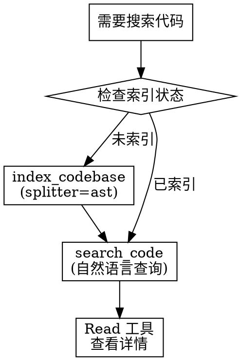

# 代码语义搜索规范

## Overview

在代码库中搜索时，优先使用 Claude Context 的语义搜索，它能理解概念和意图，而非仅匹配字符串。

## When to Use

- 搜索功能实现位置（如 "用户登录逻辑在哪"）
- 查找概念相关代码（如 "权限校验相关代码"）
- 探索代码库结构（如 "API 路由是怎么组织的"）
- 查找相似实现（如 "有没有类似的表单验证"）
- 理解不熟悉的代码库

## Quick Reference

**工具速查：**

| 工具 | 用途 | 关键参数 |
|------|------|----------|
| `index_codebase` | 索引代码库 | path, splitter="ast" |
| `search_code` | 语义搜索 | path, query, limit |
| `get_indexing_status` | 检查索引状态 | path |

**search_code vs Grep：**

| 场景 | 使用工具 |
|------|----------|
| 精确查找字符串/符号名 | Grep |
| 语义搜索、概念查找 | search_code |
| 探索不熟悉的代码库 | search_code |
| 查找函数调用位置 | Grep |

## 执行流程



## 关键规则

1. **语义优先** - 模糊/概念性搜索用 search_code
2. **自动索引** - 未索引时先执行 index_codebase
3. **路径必须绝对** - 所有路径参数必须使用绝对路径
4. **结合使用** - 必要时 search_code + Grep 配合

## Common Mistakes

| 错误 | 正确 |
|------|------|
| 用 Grep 搜索概念 | 概念性搜索用 search_code |
| 使用相对路径 | 必须使用绝对路径 |
| 未索引就搜索 | 先检查/创建索引 |
| 只用一种工具 | search_code + Grep 配合更有效 |

## 示例

用户："用户认证的逻辑在哪里？"

```
1. get_indexing_status(path: "/abs/path/to/project")
2. 如未索引: index_codebase(path: "...", splitter: "ast")
3. search_code(path: "...", query: "用户认证逻辑 登录验证")
4. Read 工具查看搜索结果中的文件
```
