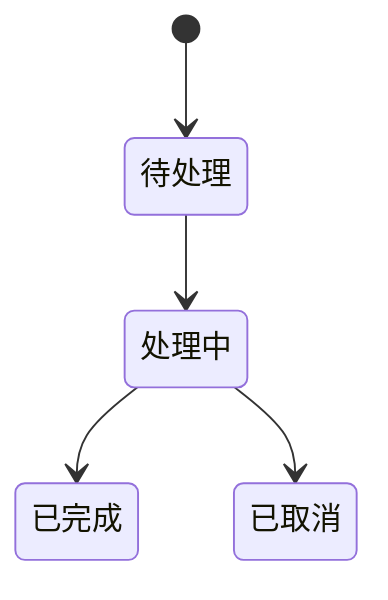

# 需求梳理 Skill

## Overview

将模糊的想法转化为清晰的需求文档。作为设计（brainstorming）的前置环节，确保在开始设计"怎么做"之前，先明确"做什么"和"为什么做"。

**核心目标：** 收集足够的信息，让后续技术设计**无需二次回访**。

## When to Use

用户通过 `/requirement-gathering` 命令手动调用。适用于：
- 有一个想法但不知道从何下手
- 想要在做设计前先把需求想清楚
- 需要生成一份结构化的需求文档

## 输出

- 需求文档 → `01-Requirements/yyyyMMdd-序号-名称.md`

---

## 模式选择

根据需求复杂度选择模式：

| 模式 | 适用场景 | 阶段数 |
|------|----------|--------|
| **轻量模式** | 小功能、配置调整、边界清晰的小需求 | 5 阶段 |
| **完整模式** | 新功能、复杂需求、涉及多方/多系统的需求 | 9 阶段 |

**启动时询问（使用 AskUserQuestion）：**
```yaml
question: "这个需求的复杂度如何？"
header: "模式选择"
options:
  - label: "轻量模式"
    description: "小功能、边界清晰、快速完成"
  - label: "完整模式（推荐）"
    description: "新功能、复杂需求、需要完整分析"
```

---

## 核心流程

```
用户输入模糊想法
      ↓
选择模式（轻量/完整）
      ↓
┌──────────────────────────────────────────────────┐
│ 引导式提问                                         │
│                                                  │
│ ① 目标与价值 - 为什么做？解决什么问题？               │
│ ② 用户场景 - 谁用？什么情境？                        │
│ ③ 功能范围与优先级 - 做什么？不做什么？MVP？          │
│ ④ 业务规则与边界 - 规则？状态？异常处理？ [完整模式]   │
│ ⑤ 数据与接口 - 输入输出？数据来源？ [完整模式]        │
│ ⑥ 角色与权限 - 谁能操作？权限控制？ [完整模式]        │
│ ⑦ 约束与集成 - 时间/技术/外部依赖？                  │
│ ⑧ 非功能需求 - 性能/安全/可用性？ [完整模式]          │
│ ⑨ 成功标准 - 可量化指标？验收方式？                   │
└──────────────────────────────────────────────────┘
      ↓
记录假设与风险
      ↓
生成需求文档草稿
      ↓
用户确认/修改
      ↓
保存到 01-Requirements/ → 结束
```

**轻量模式**执行阶段 ①②③⑦⑨，跳过 ④⑤⑥⑧。

---

## 提问原则

- **一次一个主题** - 同一主题的 2-3 个相关小问题可以合并
- **优先多选题** - 降低用户认知负担，使用 `AskUserQuestion` 工具
- **动态调整** - 根据用户回答调整后续问题深度
- **技术先调研** - 遇到技术问题先查 context7/serena，再向用户提问
- **专家用户加速** - 如果用户回答已经很清晰完整，可以跳过相关追问
- **按需深入** - 用户说"不涉及"的维度可以跳过（如无权限需求则跳过⑥）

---

## 九阶段提问指南

### 阶段 ① 目标与价值

**核心问题：为什么要做这件事？**

引导方向：
- 解决什么问题？当前的痛点是什么？
- 带来什么价值？对谁有价值？
- 如果不做会怎样？

**示例问题：**
```
"你提到想做 xxx，能说说现在遇到了什么问题吗？"
"这个功能主要是为了解决什么痛点？"
"做完这个后，你期望达到什么效果？"
```

### 阶段 ② 用户场景

**核心问题：谁在什么情况下使用？**

引导方向：
- 目标用户是谁？
- 在什么场景/情境下使用？
- 用户的操作路径是什么？

**示例问题：**
```
"这个功能主要给谁用？"
"用户会在什么情况下需要这个功能？"
"能描述一个典型的使用场景吗？从开始到结束。"
```

### 阶段 ③ 功能范围与优先级

**核心问题：做什么？不做什么？先做什么？**

引导方向：
- 必须要有的功能是什么？（P0/MVP）
- 哪些可以后续迭代？（P1/P2）
- 明确不做的边界是什么？
- 版本规划：MVP 包含什么？

**示例问题：**
```
"你觉得最核心、第一版必须要有的功能是什么？"
"有没有什么是可以放到后续版本的？"
"这个功能的边界在哪里？跟 xxx 有什么区别？"
"如果只能做一件事，你会选哪个？"
```

### 阶段 ④ 业务规则与边界条件 [完整模式]

**核心问题：有哪些业务规则？异常情况怎么处理？**

引导方向：
- 核心业务规则是什么？（如：金额不能为负、订单状态只能单向流转）
- 有哪些状态？状态之间如何转换？
- 边界情况：空值、极值、并发、重复提交怎么处理？
- 异常与回滚：失败时怎么办？需要回滚吗？

**示例问题：**
```
"这个功能有哪些必须遵守的业务规则？"
"数据有哪些状态？状态之间怎么流转？能画个简单的状态图吗？"
"如果用户输入异常数据怎么办？比如空值、超长、重复提交？"
"操作失败时需要回滚吗？还是允许部分成功？"
```

### 阶段 ⑤ 数据与接口 [完整模式]

**核心问题：数据从哪来？到哪去？格式是什么？**

引导方向：
- 输入数据：来源、格式、必填/可选字段
- 输出数据：格式、字段、谁消费
- 数据生命周期：创建、更新、删除、归档
- 数据一致性：实时同步还是最终一致？

> [!warning] 多模式/多场景时必须逐一确认
> 如果需求涉及多种模式或场景（如：卖点/非卖点、普通/VIP、A/B 版本），必须分别确认：
> - 不同模式之间的**输入数据**是否相同？
> - 不同模式之间的**输出格式**是否相同？
> - 是否可以复用同一个数据契约？
>
> **不要假设**不同模式的数据契约相同或不同，必须明确询问用户。

**示例问题：**
```
"这个功能的输入数据从哪里来？格式是什么？"
"输出给谁用？需要什么格式？"
"数据需要保留多久？有归档或删除策略吗？"
"如果涉及多个系统，数据同步是实时的还是允许延迟？"
"卖点回评和非卖点回评的输入数据是否完全相同？能共用一个数据模板吗？"
```

### 阶段 ⑥ 角色与权限 [完整模式]

**核心问题：谁能做什么？需要什么权限控制？**

引导方向：
- 涉及哪些角色？
- 每个角色能做什么操作？
- 需要审计/操作记录吗？

**示例问题：**
```
"这个功能涉及哪些角色？普通用户、管理员、还是其他？"
"不同角色的权限有什么区别？谁能看、谁能改、谁能删？"
"需要记录操作日志吗？比如谁在什么时候做了什么？"
```

**注意：** 如果用户明确说"不涉及权限控制"，可以跳过此阶段。

### 阶段 ⑦ 约束与集成

**核心问题：有什么限制条件？需要和什么系统对接？**

引导方向：
- 时间约束：有没有截止日期？
- 技术约束：必须使用的技术栈？兼容性要求？平台限制？
- 外部依赖：依赖哪些外部系统/服务/API？
- 集成方式：接口协议？调用方式？

> [!tip] 重构/改造类需求：询问改动策略
> 如果是对现有代码的重构或改造，需要额外询问：
> - **改动范围偏好**：最小化改动 vs 理想化重构？
> - **文件/命名策略**：保持原命名还是重新组织？
> - **测试成本考量**：改动量大意味着测试工作量大
>
> 默认倾向于**最小化改动**，除非用户明确要求重构。

**示例问题：**
```
"这个功能有没有时间要求？比如某个日期前必须上线？"
"技术上有没有限制？比如必须用某个框架或兼容某个版本？"
"需要和哪些外部系统对接？用什么协议？REST、消息队列、还是其他？"
"部署环境有什么限制吗？"
"文件结构上，是希望保持原有命名最小改动，还是重新组织？"
```

### 阶段 ⑧ 非功能需求 [完整模式]

**核心问题：除了功能，还有什么质量要求？**

引导方向：
- 性能：响应时间、并发量、数据量
- 可用性：SLA、可接受的故障时间
- 安全/合规：敏感数据处理、加密、权限、合规要求
- 可维护性：日志、监控、告警
- 可扩展性：未来可能的扩展方向

**示例问题：**
```
"对性能有要求吗？比如响应时间要在多少毫秒内？支持多少并发？"
"可用性有什么期望？99.9%？能接受多长时间的故障？"
"这个功能涉及敏感数据吗？需要加密或脱敏吗？"
"有合规要求吗？比如 GDPR、等保？"
"需要什么级别的监控和告警？"
```

### 阶段 ⑨ 成功标准

**核心问题：怎么知道做成功了？**

引导方向：
- 完成标准：什么情况算"做完了"？
- 量化指标：
  - 指标名称
  - 当前基线
  - 目标值
  - 采集方式
  - 验证周期
- 验收方式：谁来验收？怎么验？

**示例问题：**
```
"怎么算是做完了？有没有明确的验收标准？"
"有没有可以量化的成功指标？比如'错误率从 5% 降到 1%'？"
"当前的基线是什么？目标是多少？怎么测量？"
"谁来验收这个功能？验收的流程是什么？"
```

---

## 假设与风险记录

在提问过程中，注意收集：

**假设（Assumptions）：**
- 用户提到但未验证的前提条件
- 对外部依赖的假设
- 对用户行为的假设

**风险（Risks）：**
- 不确定的技术点
- 可能的变更点
- 外部依赖的不确定性

**示例：**
```
假设：用户已经有账号系统，可以直接复用
风险：第三方 API 的稳定性未验证，可能影响 SLA
```

---

## 需求文档模板

> [!warning] 日期使用当前系统日期
> `{日期}` 必须替换为**当前系统日期**（格式：YYYY-MM-DD），不要手动猜测年份。

### 轻量模板

```markdown
---
created: {日期}
updated: {日期}
project: {项目名称}
status: 进行中
tags: [需求, {相关标签}]
---

# {需求标题}

## 背景与目标

### 问题/痛点
{当前遇到的问题}

### 期望价值
{做完后的效果}

## 用户场景

### 目标用户
{谁会使用}

### 典型场景
{使用场景描述}

## 功能范围

### MVP 功能（P0）
- {第一版必须实现的功能}

### 后续迭代（P1/P2）
- {可以后续考虑的功能}

### 不在范围内
- {明确不做的事情}

## 约束条件
- 时间：{截止日期}
- 技术：{技术限制}
- 依赖：{外部依赖}

## 成功标准

| 指标 | 当前基线 | 目标值 | 采集方式 | 验证周期 |
|------|----------|--------|----------|----------|
| {指标} | {基线} | {目标} | {如何测量} | {何时验证} |

## 假设与风险

### 假设
- {前提假设}

### 风险
- {潜在风险}
```

### 完整模板

```markdown
---
created: {日期}
updated: {日期}
project: {项目名称}
status: 进行中
tags: [需求, {相关标签}]
priority: P0
---

# {需求标题}

## 背景与目标

### 问题/痛点
{当前遇到的问题，为什么需要这个功能}

### 期望价值
{做完后期望达到的效果，对谁有价值}

## 用户场景

### 目标用户
{谁会使用这个功能}

### 典型场景
{1-2 个具体的使用场景描述}

### 用户旅程
{用户操作路径，从开始到结束}

## 功能范围

### MVP / Phase 1（P0）
- {第一版必须实现的功能点}

### Phase 2（P1）
- {后续迭代的功能点}

### 不在范围内（Out of Scope）
- {明确不做的事情}

## 业务规则

### 核心规则
- {必须遵守的业务规则}

### 状态流转
{状态机描述或 Mermaid 图}



### 边界与异常处理
| 场景 | 处理方式 |
|------|----------|
| 空值输入 | {处理方式} |
| 重复提交 | {处理方式} |
| 操作失败 | {回滚策略} |

## 数据契约

### 输入数据
| 字段 | 类型 | 必填 | 来源 | 说明 |
|------|------|------|------|------|
| {字段名} | {类型} | {是/否} | {来源} | {说明} |

### 输出数据
| 字段 | 类型 | 说明 |
|------|------|------|
| {字段名} | {类型} | {说明} |

### 数据生命周期
- 创建：{何时创建}
- 更新：{更新策略}
- 归档/删除：{保留策略}

## 角色与权限

### 角色定义
| 角色 | 说明 |
|------|------|
| {角色名} | {职责} |

### 权限矩阵
| 操作 | 角色A | 角色B | 角色C |
|------|-------|-------|-------|
| 查看 | ✓ | ✓ | ✓ |
| 编辑 | ✓ | ✓ | - |
| 删除 | ✓ | - | - |

### 审计要求
{操作日志记录要求}

## 约束与集成

### 时间约束
{截止日期、里程碑}

### 技术约束
{技术栈、兼容性、平台限制}

### 外部依赖
| 系统/服务 | 用途 | 接口协议 | 备注 |
|-----------|------|----------|------|
| {系统名} | {用途} | {REST/MQ/...} | {注意事项} |

## 非功能需求

### 性能
| 指标 | 要求 |
|------|------|
| 响应时间 | {如 P99 < 200ms} |
| 并发量 | {如 100 QPS} |
| 数据量 | {预估数据规模} |

### 可用性
| 指标 | 要求 |
|------|------|
| SLA | {如 99.9%} |
| 容灾 | {故障恢复策略} |

### 安全与合规
- 数据加密：{是否需要、哪些字段}
- 敏感数据：{脱敏策略}
- 合规要求：{GDPR/等保/其他}

### 可维护性
- 日志：{日志级别、关键日志}
- 监控：{监控指标}
- 告警：{告警规则}

## 成功标准

### 量化指标

| 指标 | 当前基线 | 目标值 | 采集方式 | 验证周期 |
|------|----------|--------|----------|----------|
| {指标} | {当前} | {目标} | {如何测量} | {何时验证} |

### 验收方式
- 验收人：{谁}
- 验收流程：{步骤}
- 验收标准：{checklist}

## 假设与风险

### 假设
| 假设内容 | 验证方式 |
|----------|----------|
| {假设} | {如何验证} |

### 风险
| 风险 | 影响 | 概率 | 应对措施 |
|------|------|------|----------|
| {风险} | {高/中/低} | {高/中/低} | {缓解方案} |
```

---

## 流程结束

完成提问后：

1. **生成草稿** - 按模板生成需求文档草稿，展示给用户
2. **用户确认** - 询问用户是否需要修改
3. **保存文档** - 用户确认后，调用 `doc-writer` 保存到 `01-Requirements/`
4. **后续提示** - 提示用户可以继续调用 `brainstorming` 进行设计

**结束选项（使用 AskUserQuestion）：**
```yaml
question: "需求文档已生成，接下来？"
header: "下一步"
options:
  - label: "保存需求，稍后设计"
    description: "仅保存需求文档，稍后再调用 brainstorming"
  - label: "保存需求并继续设计"
    description: "保存后立即调用 brainstorming 进行设计"
```

---

## 降级方案

当工具不可用时的 fallback：

| 工具 | 降级方案 |
|------|----------|
| `AskUserQuestion` | 直接用文本提问，用户自由回答 |
| `doc-writer` | 输出 Markdown 内容，用户手动保存 |
| `context7/serena` | 询问用户提供相关信息 |

---

## Common Mistakes

| 错误 | 正确做法 |
|------|----------|
| 一次问太多问题 | 同一主题 2-3 个问题可合并，但不要跨主题 |
| 直接跳到"怎么做" | 先确保"做什么"和"为什么"清晰 |
| 假设用户知道自己要什么 | 通过提问帮助用户理清思路 |
| 忽略"不做什么" | 明确边界和排除项同样重要 |
| 成功标准只写"功能正常" | 必须有可量化指标：基线→目标→测量方式 |
| 技术细节过早介入 | 需求阶段关注目标和范围，不关注实现细节 |
| 跳过业务规则 | 完整模式下必须收集规则、状态、异常处理 |
| 不收集数据契约 | 输入输出、字段、来源是设计的关键输入 |
| 忽略权限需求 | 角色权限是常见返工点，必须提前明确 |
| 不记录假设和风险 | 不确定点必须显式记录，便于后续验证 |
| 对专家用户过度提问 | 用户回答已清晰完整时，可以跳过追问 |
| 用户说"不涉及"仍强问 | 按需深入，不涉及的维度可以跳过 |

---

## 依赖

**必需调用：**
- `doc-writer` - 保存需求文档到知识库

**可选调用：**
- `context7` - 遇到技术问题时查询文档
- `serena` - 了解项目现有实现
- `doc-reader` - 查看历史需求文档
