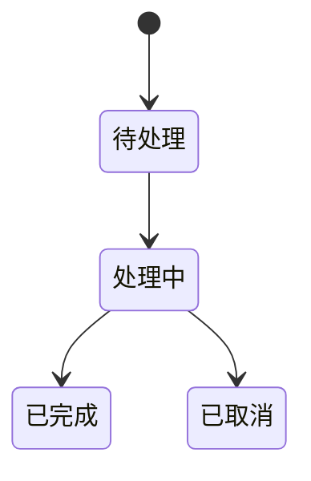

# 需求梳理 Skill

## Overview

将模糊的想法转化为清晰的需求文档。作为设计（brainstorming）的前置环节，确保在开始设计"怎么做"之前，先明确"做什么"、"为什么做"。

**核心目标：** 通过友好的对话引导，帮助用户理清思路，收集足够的信息让后续技术设计**无需二次回访**。

## When to Use

用户通过 `/requirement-gathering` 命令手动调用。适用于：
- 有一个想法但不知道从何下手
- 想要在做设计前先把需求想清楚
- 需要生成一份结构化的需求文档

## 输出

- 需求文档 → `01-Requirements/yyyyMMdd-序号-名称.md`

---

## 交互原则（最重要）

### 核心规则：每次只问一个问题

**严格执行：**
- 每条消息只包含**一个问题**
- 禁止在同一条消息中提问多个维度
- 如果一个主题需要深入，拆成多条消息逐步追问
- 不要提前暴露完整框架或后续要问的问题

<example type="bad">
❌ 错误示例 - 一次问多个维度：

"让我来梳理这个需求：

**一、目标与价值**
你提到想做 xxx，能说说遇到什么问题吗？如果不做会怎样？

**二、用户场景**
这个功能主要给谁用？在什么情况下使用？

**三、功能范围**
核心功能是什么？有没有明确不做的边界？"
</example>

<example type="good">
✅ 正确示例 - 每次只问一个：

"你提到想做 xxx，能说说现在遇到什么问题吗？是什么痛点让你想做这个？"

[等待用户回答后]

"明白了。那这个功能主要是给谁用的？"

[等待用户回答后继续下一个问题]
</example>

### 提供建议性选项

**优先使用多选题 + 推荐选项：**
- 根据用户输入和项目上下文，给出 2-4 个合理选项
- 用 `(推荐)` 标记你认为最合适的选项
- 附带简短理由解释为什么推荐
- 使用 `AskUserQuestion` 工具时，把推荐选项放在第一位

<example type="good">
✅ 好的问法 - 给出建议性选项：

"关于集成方式，我理解可能有几种选择：

1. **MCP Server** - 让 Claude Code 通过标准协议调用 (推荐，符合 Claude Code 生态)
2. **Subagent** - 作为 Task 工具的一种 agent 类型
3. **Hook 触发** - 在特定事件后自动执行

你倾向哪种？还是有其他想法？"
</example>

<example type="bad">
❌ 不好的问法 - 纯开放式：

"你想怎么集成？"
</example>

### 其他原则

- **动态调整** - 根据用户回答调整后续问题深度
- **技术先调研** - 遇到技术问题先查 context7/serena，再向用户提问
- **专家用户加速** - 如果用户回答已经很清晰完整，可以跳过相关追问
- **按需深入** - 用户说"不涉及"的维度可以跳过
- **不要机械照搬** - 阶段指南是参考，根据实际对话灵活调整

---

## 模式选择

根据需求复杂度选择模式：

| 模式 | 适用场景 | 覆盖阶段 |
|------|----------|----------|
| **轻量模式** | 小功能、配置调整、边界清晰 | ①②③⑦⑨ |
| **完整模式** | 新功能、复杂需求、涉及多方 | 全部 10 阶段 |

**启动时询问（使用 AskUserQuestion）：**
```yaml
question: "这个需求的复杂度如何？"
header: "模式选择"
options:
  - label: "轻量模式"
    description: "小功能、边界清晰、快速完成"
  - label: "完整模式（推荐）"
    description: "新功能、复杂需求、需要完整分析"
```

---

## 提问阶段概览

**不要把这个框架暴露给用户，只在心里记住，逐步推进：**

| 阶段 | 核心问题 | 轻量模式 |
|------|----------|----------|
| ① 目标与价值 | 为什么做？解决什么问题？ | ✓ |
| ② 用户场景 | 谁用？什么情境？ | ✓ |
| ③ 功能范围 | 做什么？不做什么？MVP？ | ✓ |
| ④ 业务规则 | 规则？状态？异常处理？ | - |
| ⑤ 数据与接口 | 输入输出？数据来源？ | - |
| ⑥ 角色与权限 | 谁能操作？权限控制？ | - |
| ⑦ 约束与集成 | 时间/技术/外部依赖？ | ✓ |
| ⑧ 非功能需求 | 性能/安全/可用性？ | - |
| ⑨ 成功标准 | 可量化指标？验收方式？ | ✓ |
| ⑩ 风险与假设 | 不确定点？应对措施？ | 可选 |

---

## 各阶段提问要点

**记住：每次只问一个问题，根据用户回答灵活调整。以下是每个阶段的核心方向，不是必须照搬的脚本。**

### ① 目标与价值
- 解决什么问题？痛点是什么？
- 带来什么价值？对谁有价值？
- 示例："你提到想做 xxx，能说说现在遇到什么问题吗？"

### ② 用户场景
- 目标用户是谁？
- 在什么场景下使用？
- 示例："这个功能主要给谁用？" → "能描述一个典型的使用场景吗？"

### ③ 功能范围
- MVP 必须有什么？
- 哪些可以后续迭代？
- 明确不做的边界
- 示例："如果只能做一件事，你会选哪个？"

### ④ 业务规则 [完整模式]
- 核心业务规则
- 状态流转
- 异常处理、回滚策略

### ⑤ 数据与接口 [完整模式]
- 输入数据来源、格式
- 输出给谁、什么格式
- 数据生命周期

> [!warning] 多模式场景
> 如果涉及多种模式（如 A/B 版本），必须分别确认数据契约是否相同，不要假设。

### ⑥ 角色与权限 [完整模式]
- 涉及哪些角色？
- 权限矩阵
- 用户说"不涉及"可跳过

### ⑦ 约束与集成
- 时间约束
- 技术约束、平台限制
- 外部依赖、集成方式

> [!tip] 重构类需求
> 额外询问：最小化改动 vs 理想化重构？默认倾向最小化改动。

### ⑧ 非功能需求 [完整模式]
- 性能（响应时间、并发）
- 可用性（SLA）
- 安全/合规

### ⑨ 成功标准
- 怎么算做完了？
- 量化指标：基线 → 目标 → 测量方式
- 谁来验收？

### ⑩ 风险与假设
- 关键假设（未验证的前提）
- 风险及应对措施

---

## 假设与风险记录

在对话过程中，注意收集：

| 类型 | 收集内容 |
|------|----------|
| **假设** | 用户提到但未验证的前提、对外部依赖的假设 |
| **风险** | 不确定的技术点、可能的变更点、外部依赖不确定性 |

示例：
- 假设：用户已有账号系统可复用
- 风险：第三方 API 稳定性未验证

---

## 需求文档模板

> [!warning] 日期使用当前系统日期
> `{日期}` 必须替换为**当前系统日期**（格式：YYYY-MM-DD），不要手动猜测年份。

### 轻量模板

```markdown
---
created: {日期}
updated: {日期}
project: {项目名称}
status: 进行中
tags: [需求, {相关标签}]
---

# {需求标题}

## 背景与目标

### 问题/痛点
{当前遇到的问题}

### 期望价值
{做完后的效果}

## 用户场景

### 目标用户
{谁会使用}

### 典型场景
{使用场景描述}

## 功能范围

### MVP 功能（P0）
- {第一版必须实现的功能}

### 后续迭代（P1/P2）
- {可以后续考虑的功能}

### 不在范围内
- {明确不做的事情}

## 约束条件
- 时间：{截止日期}
- 技术：{技术限制}
- 依赖：{外部依赖}

## 成功标准

| 指标 | 当前基线 | 目标值 | 采集方式 | 验证周期 |
|------|----------|--------|----------|----------|
| {指标} | {基线} | {目标} | {如何测量} | {何时验证} |

## 假设与风险

### 假设
- {前提假设}

### 风险
- {潜在风险}
```

### 完整模板

```markdown
---
created: {日期}
updated: {日期}
project: {项目名称}
status: 进行中
tags: [需求, {相关标签}]
priority: P0
---

# {需求标题}

## 背景与目标

### 问题/痛点
{当前遇到的问题，为什么需要这个功能}

### 期望价值
{做完后期望达到的效果，对谁有价值}

## 用户场景

### 目标用户
{谁会使用这个功能}

### 典型场景
{1-2 个具体的使用场景描述}

### 用户旅程
{用户操作路径，从开始到结束}

## 功能范围

### MVP / Phase 1（P0）
- {第一版必须实现的功能点}

### Phase 2（P1）
- {后续迭代的功能点}

### 不在范围内（Out of Scope）
- {明确不做的事情}

## 业务规则

### 核心规则
- {必须遵守的业务规则}

### 状态流转
{状态机描述或 Mermaid 图}



### 边界与异常处理
| 场景 | 处理方式 |
|------|----------|
| 空值输入 | {处理方式} |
| 重复提交 | {处理方式} |
| 操作失败 | {回滚策略} |

## 数据契约

### 输入数据
| 字段 | 类型 | 必填 | 来源 | 说明 |
|------|------|------|------|------|
| {字段名} | {类型} | {是/否} | {来源} | {说明} |

### 输出数据
| 字段 | 类型 | 说明 |
|------|------|------|
| {字段名} | {类型} | {说明} |

### 数据生命周期
- 创建：{何时创建}
- 更新：{更新策略}
- 归档/删除：{保留策略}

## 角色与权限

### 角色定义
| 角色 | 说明 |
|------|------|
| {角色名} | {职责} |

### 权限矩阵
| 操作 | 角色A | 角色B | 角色C |
|------|-------|-------|-------|
| 查看 | ✓ | ✓ | ✓ |
| 编辑 | ✓ | ✓ | - |
| 删除 | ✓ | - | - |

### 审计要求
{操作日志记录要求}

## 约束与集成

### 时间约束
{截止日期、里程碑}

### 技术约束
{技术栈、兼容性、平台限制}

### 外部依赖
| 系统/服务 | 用途 | 接口协议 | 备注 |
|-----------|------|----------|------|
| {系统名} | {用途} | {REST/MQ/...} | {注意事项} |

## 非功能需求

### 性能
| 指标 | 要求 |
|------|------|
| 响应时间 | {如 P99 < 200ms} |
| 并发量 | {如 100 QPS} |
| 数据量 | {预估数据规模} |

### 可用性
| 指标 | 要求 |
|------|------|
| SLA | {如 99.9%} |
| 容灾 | {故障恢复策略} |

### 安全与合规
- 数据加密：{是否需要、哪些字段}
- 敏感数据：{脱敏策略}
- 合规要求：{GDPR/等保/其他}

### 可维护性
- 日志：{日志级别、关键日志}
- 监控：{监控指标}
- 告警：{告警规则}

## 成功标准

### 量化指标

| 指标 | 当前基线 | 目标值 | 采集方式 | 验证周期 |
|------|----------|--------|----------|----------|
| {指标} | {当前} | {目标} | {如何测量} | {何时验证} |

### 验收方式
- 验收人：{谁}
- 验收流程：{步骤}
- 验收标准：{checklist}

## 假设与风险

### 假设
| 假设内容 | 验证方式 |
|----------|----------|
| {假设} | {如何验证} |

### 风险
| 风险 | 影响 | 概率 | 应对措施 |
|------|------|------|----------|
| {风险} | {高/中/低} | {高/中/低} | {缓解方案} |
```

---

## 流程结束

完成提问后：

1. **生成草稿** - 按模板生成需求文档草稿，展示给用户
2. **用户确认** - 询问用户是否需要修改
3. **保存文档** - 用户确认后，调用 `doc-writer` 保存到 `01-Requirements/`
4. **后续提示** - 提示用户可以继续调用 `brainstorming` 进行设计

**结束选项（使用 AskUserQuestion）：**
```yaml
question: "需求文档已生成，接下来？"
header: "下一步"
options:
  - label: "保存需求，稍后设计"
    description: "仅保存需求文档，稍后再调用 brainstorming"
  - label: "保存需求并继续设计"
    description: "保存后立即调用 brainstorming 进行设计"
```

---

## 降级方案

当工具不可用时的 fallback：

| 工具 | 降级方案 |
|------|----------|
| `AskUserQuestion` | 直接用文本提问，用户自由回答 |
| `doc-writer` | 输出 Markdown 内容，用户手动保存 |
| `context7/serena` | 询问用户提供相关信息 |

---

## Common Mistakes

| 错误 | 正确做法 |
|------|----------|
| **一次问多个问题** | 每条消息只问一个问题，等用户回答后再问下一个 |
| **暴露完整框架** | 不要告诉用户"接下来我会问 10 个阶段"，自然对话 |
| **纯开放式提问** | 给出 2-4 个建议选项，标记推荐项 |
| **机械照搬问题** | 根据用户回答灵活调整，跳过不相关的 |
| 直接跳到"怎么做" | 先确保"做什么"和"为什么"清晰 |
| 假设用户知道自己要什么 | 通过提问帮助用户理清思路 |
| 忽略"不做什么" | 明确边界和排除项同样重要 |
| 成功标准只写"功能正常" | 必须有可量化指标：基线→目标→测量方式 |
| 不记录假设和风险 | 不确定点必须显式记录，便于后续验证 |
| 对专家用户过度提问 | 用户回答已清晰完整时，可以跳过追问 |
| 用户说"不涉及"仍强问 | 按需深入，不涉及的维度可以跳过 |

---

## 依赖

**必需调用：**
- `doc-writer` - 保存需求文档到知识库

**可选调用：**
- `context7` - 遇到技术问题时查询文档
- `serena` - 了解项目现有实现
- `doc-reader` - 查看历史需求文档
