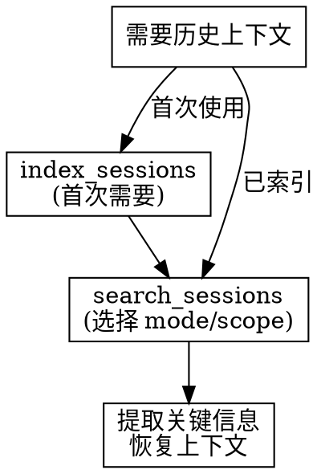

# 会话上下文恢复规范

## Overview

使用 Claude Context 的会话搜索功能恢复历史上下文，帮助用户找回之前讨论过的方案、决策和代码。

## When to Use

- 重启 Claude Code 后需要恢复工作上下文
- 用户说 "之前我们讨论过..." 但当前会话没有记录
- 查找之前讨论过的设计方案或决策
- 调试问题时需要回顾之前的讨论
- 了解某个问题的历史处理过程

## Quick Reference

**工具速查：**

| 工具 | 用途 | 关键参数 |
|------|------|----------|
| `index_sessions` | 索引会话历史 | scope, force |
| `search_sessions` | 搜索会话 | query, mode, scope, limit |

**搜索模式：**

| mode | 说明 | 适用场景 |
|------|------|----------|
| vector | 语义相似度（默认） | 模糊查找、概念搜索 |
| text | 关键词搜索 | 精确查找特定内容 |
| both | 混合搜索 | 不确定时使用 |

**搜索范围：**

| scope | 说明 |
|-------|------|
| current | 当前项目的会话（默认） |
| all | 所有项目的会话 |

## 执行流程



## 关键规则

1. **主动提示** - 检测到可能需要历史上下文时提醒用户
2. **scope 选择** - 默认 current 项目，跨项目用 all
3. **先索引再搜索** - 首次使用需要先索引会话
4. **隐私意识** - 仅搜索必要信息，不过度暴露历史

## Common Mistakes

| 错误 | 正确 |
|------|------|
| 未索引就搜索 | 首次使用先 index_sessions |
| 跨项目搜索用 current | 跨项目用 scope: "all" |
| 只用 text 模式 | 概念性查找用 vector 模式 |
| 返回太多结果 | 设置合理的 limit |

## 示例

用户："之前我们讨论过登录功能的实现方案，能帮我找一下吗？"

```
1. index_sessions(scope: "current")  // 首次需要
2. search_sessions(query: "登录功能 实现方案", mode: "vector", scope: "current")
3. 返回相关会话摘要，帮助用户恢复上下文
```
