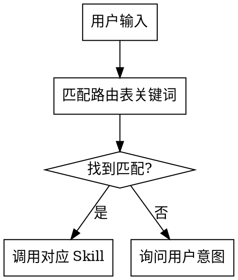

# Skill 路由器

## Overview

根据用户意图智能匹配最合适的 skill，解决 skill 名称记忆困难的问题。

## When to Use

- 用户任务可能需要某个 skill 但不确定用哪个
- 用户使用模糊描述（如 "帮我整理思路"）
- 用户提到某个功能但没有明确指定 skill

## 路由表

| 用户意图关键词 | 推荐 Skill | 说明 |
|---------------|-----------|------|
| 脑暴/brainstorm/想法/设计/思路 | `superpowers:brainstorming` | 创意探索和设计 |
| 计划/plan/实现/步骤 | `superpowers:writing-plans` | 实现计划编写 |
| 调试/debug/bug/报错/问题 | `superpowers:systematic-debugging` | 问题排查 |
| 提交/commit/git | `froggo-skills:git-commit` | Git 提交规范 |
| 写文档/保存/输出文档 | `froggo-skills:doc-writer` | 文档输出到知识库 |
| 找文档/搜索文档/查看 | `froggo-skills:doc-reader` | 知识库搜索 |
| 禅道/任务同步/T1234 | `froggo-skills:zentao-syncer` | 禅道同步 |
| API/库/怎么用/用法 | `froggo-skills:lib-docs` | 库文档查询 |
| 代码在哪/找代码/搜索代码 | `froggo-skills:code-search` | 代码语义搜索 |
| 之前讨论/上次说的/历史 | `froggo-skills:session-context` | 会话历史恢复 |
| word/docx/文档转换 | `document-skills:docx` | Word 文档处理 |

## 执行流程

## 使用方式

直接描述你的需求，我会自动匹配合适的 skill：

- "帮我整理一下这个功能的思路" → brainstorming
- "写个实现计划" → writing-plans
- "这个 bug 怎么调" → systematic-debugging
- "提交代码" → git-commit
- "React hooks 怎么用" → lib-docs
