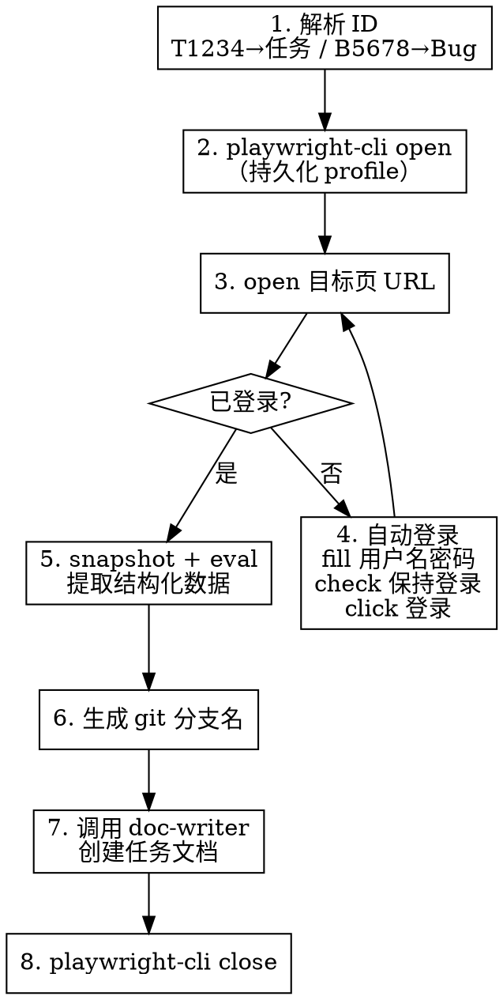

# 禅道任务同步

## Overview

从禅道抓取任务/Bug 详情，通过 playwright-cli 浏览器自动化访问禅道页面，提取结构化数据，自动创建符合规范的任务文档到知识库。

## When to Use

- 用户提到"同步禅道任务/Bug"
- 用户给出禅道 ID（如 T1234、B5678）
- 需要将禅道任务导入知识库开始开发时

## Quick Reference

**ID 格式：**

| 输入 | 类型 | URL 路径 |
|------|------|----------|
| T1234 | 任务 | task-view-1234.html |
| B5678 | Bug | bug-view-5678.html |

**禅道地址：** `https://chandao.bytenew.com/zentao/`

**输出位置：** `~/workspace/Knowledge-Library/02-Tasks/yyyyMMdd-{ID}-{标题}.md`

## 执行流程



## playwright-cli 命令序列

### 第一步：打开浏览器并访问目标页

```bash
# 打开浏览器并导航到目标页（持久化 profile，保持登录态）
# 注意：playwright-cli 没有 goto 命令，用 open <url> 导航
playwright-cli open https://chandao.bytenew.com/zentao/{type}-view-{id}.html

# 获取快照检查状态
playwright-cli snapshot
```

### 第二步：登录检测与处理

检查 snapshot 输出：
- 若页面 URL 包含 `user-login` 或 title 包含 `用户登录` → 需要登录
- 否则 → 已登录，跳到第三步

**自动登录命令序列：**

```bash
# 前置条件：需要环境变量 ZENTAO_USER 和 ZENTAO_PASSWORD
playwright-cli open https://chandao.bytenew.com/zentao/user-login.html

# 获取快照确认登录表单已加载
playwright-cli snapshot

# 填入凭据（ref 可能变化，根据 snapshot 确认）
playwright-cli fill <用户名输入框ref> "$ZENTAO_USER"
playwright-cli fill <密码输入框ref> "$ZENTAO_PASSWORD"

# 勾选"保持登录"
playwright-cli check <保持登录checkbox-ref>

# 点击登录
playwright-cli click <登录按钮ref>

# 验证登录成功：检查 URL 不再包含 user-login
playwright-cli snapshot

# 登录成功后禅道可能跳转到其他页面，需重新导航到目标页
playwright-cli open https://chandao.bytenew.com/zentao/{type}-view-{id}.html
```

**登录表单已知结构（供参考，ref 每次会变）：**
- 用户名输入框：`textbox` in row "用户名"
- 密码输入框：`textbox` in row "密码"
- 保持登录：`checkbox " 保持登录"`
- 登录按钮：`button "登录"`

### 第三步：提取数据

禅道使用双层 iframe 结构，snapshot 自动穿透。根据 snapshot 中的 ref 识别字段位置。

**Bug 页面关键字段位置（基于实际探索 Bug #49622）：**
- 标题：header 区域，格式为 `generic: "{id}"` + `text: 标题内容`
- 基本信息表格：`table` 内 `row "字段名 值"` 结构
  - 所属产品、所属模块、Bug类型、严重程度、优先级、Bug状态、当前指派
- 重现步骤：`generic: 重现步骤` 下的文本内容
- 历史记录：`list` 内 `listitem` 序列

**使用 run-code 提取数据（在正确的 iframe context 中）：**

将以下脚本保存为临时文件后通过 `playwright-cli run-code "$(cat /tmp/zentao-extract.js)"` 执行（避免引号转义问题）：

```javascript
// /tmp/zentao-extract.js
async page => {
  const frames = page.frames();
  // 禅道详情页在 app-qa 或 app-my 等 iframe 中
  const detailFrame = frames.find(f => f.name().startsWith('app-'));
  if (!detailFrame) return 'ERROR: app iframe not found';

  const data = await detailFrame.evaluate(() => {
    const getText = (label) => {
      for (const row of document.querySelectorAll('tr')) {
        const th = row.querySelector('th, td:first-child');
        if (th && th.textContent.trim().startsWith(label)) {
          const cells = row.querySelectorAll('td');
          const valueCell = cells.length > 1 ? cells[cells.length - 1] : cells[0];
          if (valueCell) return valueCell.textContent.trim();
        }
      }
      return '';
    };

    // 标题：从 document.title 提取最可靠
    const pageTitle = document.title || '';
    let title = pageTitle.replace(/^(BUG|任务) #\d+\s*/, '').replace(/ - .*$/, '').trim();

    // 描述/重现步骤
    // 注意：禅道的描述区域 class 是 "detail-content article-content"（同一元素上的两个 class）
    // 必须用 .detail-content.article-content（无空格），而非 .detail-content .article-content（后代选择器）
    const descEl = document.querySelector('.detail-content.article-content');
    let description = '';
    if (descEl) {
      description = descEl.innerText.trim();
    }

    // 清理时间后缀
    const clean = (s) => s.replace(/\s*于\s*\d{4}-\d{2}-\d{2}.*$/, '');

    return JSON.stringify({
      title,
      product: getText('所属产品'),
      module: getText('所属模块'),
      bugType: getText('Bug类型'),
      severity: getText('严重程度'),
      priority: getText('优先级'),
      status: getText('Bug状态') || getText('任务状态'),
      assignee: clean(getText('当前指派') || getText('指派给')),
      estimate: getText('预计'),
      startDate: getText('预计开始'),
      deadline: getText('截止日期'),
      execution: getText('所属执行'),
      description,
      createdBy: clean(getText('由谁创建')),
    }, null, 2);
  });
  return data;
}
```

**注意事项：**
- iframe 通过 `f.name().startsWith('app-')` 定位（如 `app-qa`、`app-my`）
- `run-code` 的返回值会显示在 Result 中，无需 `console.log`
- 直接在命令行内写多行 JS 会有引号转义问题，推荐写入临时文件后 `$(cat file)` 执行

### 第四步：生成 git 分支名

根据类型和禅道 ID 自动生成，格式为 `{type}_{yyyyMMdd}_{zentaoId}`：

| 禅道类型 | 分支格式 | 示例 |
|----------|----------|------|
| Task (T) | `ft_{yyyyMMdd}_T{id}` | `ft_20260227_T42605` |
| Bug (B) | `hotfix_{yyyyMMdd}_B{id}` | `hotfix_20260225_B49564` |

**命名规则：**
- `yyyyMMdd` 为当天日期
- 使用下划线 `_` 分隔，不使用 `/` 或 `-`
- 不包含中文描述

### 第五步：创建任务文档

> **重要：** 不要使用 `obsidian-cli create --content "$(cat file)"` 方式创建文档，因为内容中的 `=`、括号等特殊字符会在 shell `$()` 展开时被截断。
> 应直接使用 Write 工具写入 `~/workspace/Knowledge-Library/02-Tasks/yyyyMMdd-{ID}-{标题}.md` 文件。

文档 frontmatter 包含：

```yaml
created: {今日日期}
updated: {今日日期}
zentao_id: {B49622 或 T1234}
zentao_url: https://chandao.bytenew.com/zentao/{type}-view-{id}.html
git_branch: hotfix_20260225_B49622
status: 进行中
project: {从所属产品/执行推断}
tags:
  - task 或 bug
  - {产品名}
```

### 第六步：关闭浏览器

```bash
playwright-cli close
```

## 认证配置

| 环境变量 | 说明 | 必需 |
|----------|------|------|
| `ZENTAO_USER` | 禅道用户名 | ✅（仅首次登录需要） |
| `ZENTAO_PASSWORD` | 禅道密码 | ✅（仅首次登录需要） |

**配置方式：**
```bash
export ZENTAO_USER="your_username"
export ZENTAO_PASSWORD="your_password"
```

playwright-cli 默认使用持久化 profile，勾选"保持登录"后 cookie 长期有效，后续无需重复登录。

## 抓取字段

**任务 (Task)：**
标题、优先级、预计工时、指派人、状态、开始日期、截止日期、所属执行、相关需求、描述

**Bug：**
标题、优先级、严重程度、指派人、状态、Bug类型、所属产品、所属模块、描述

## 错误处理

| 场景 | 处理 |
|------|------|
| playwright-cli 未安装 | 提示 `npm install -g playwright-cli` 或使用 `npx playwright-cli` |
| Chrome 占用冲突 | 使用 `playwright-cli open --browser=chromium` 回退 |
| 登录失败 | 检测登录页错误提示，输出具体原因 |
| 环境变量未配置且未登录 | 提示设置 `ZENTAO_USER` 和 `ZENTAO_PASSWORD` |
| 任务/Bug 不存在 | 检测页面是否包含 404 或错误信息 |
| 页面加载超时 | snapshot 重试一次，仍失败则截图 `playwright-cli screenshot` |

## Common Mistakes

| 错误 | 正确 |
|------|------|
| 输入 `1234` | 输入 `T1234`（需要 T/B 前缀） |
| 输入 `t1234` | 输入 `T1234`（前缀大写） |
| 使用 `--isolated` 模式 | 不加 `--isolated`，保持持久化 profile |
| 手动创建文档 | 使用本 skill 自动创建 |
| 用 `.detail-content .article-content` 选择描述 | 用 `.detail-content.article-content`（无空格，同元素多class） |
| 用 `obsidian-cli --content "$(cat file)"` 写文档 | 用 Write 工具直接写入文件（避免 shell 特殊字符截断） |

## 依赖

**REQUIRED SUB-SKILL:** Use `doc-writer` for document creation with task template
**REQUIRED SUB-SKILL:** Use `obsidian:obsidian-markdown` for complete Obsidian syntax reference
**REFERENCE:** `git-commit` skill 的分支命名规范
