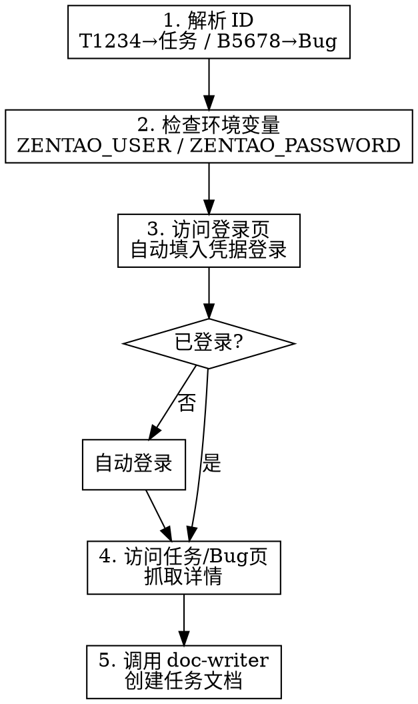

# 禅道任务同步

## Overview

从禅道抓取任务/Bug 详情，自动创建符合规范的任务文档到知识库，确保开发任务可追溯。

## When to Use

- 执行 `/zentao-sync T1234` 同步任务
- 执行 `/zentao-sync B5678` 同步 Bug
- 需要将禅道任务导入知识库开始开发时

## Quick Reference

**ID 格式：**

| 输入 | 类型 | URL 路径 |
|------|------|----------|
| T1234 | 任务 | task-view-1234.html |
| B5678 | Bug | bug-view-5678.html |

**禅道地址：** `https://chandao.bytenew.com/zentao/`

**输出位置：** `~/workspace/Knowledge-Library/02-Tasks/yyyyMMdd-{ID}-{标题}.md`

## 执行流程



## 脚本执行

使用内置脚本自动抓取禅道页面，无需手动分析页面结构：

```bash
# 进入 playwright-skill 目录执行
cd ~/.claude/plugins/cache/playwright-skill/playwright-skill/*/skills/playwright-skill

# 通过环境变量传递禅道 ID
ZENTAO_ID=T1234 node run.js ~/.claude/plugins/cache/froggo-skills/froggo-skills/*/skills/zentao-syncer/scripts/zentao-scraper.js
```

**脚本输出：**
- JSON 数据：`/tmp/zentao-T1234.json`
- 页面截图：`/tmp/zentao-T1234.png`（备用）

**JSON 格式示例：**
```json
{
  "id": "T42093",
  "type": "task",
  "title": "巨易erp商品数据源对接",
  "priority": "P2",
  "estimate": "24h",
  "assignee": "青蛙",
  "status": "未开始",
  "description": "...",
  "relatedStory": { "text": "需求标题", "href": "..." }
}
```

## 认证配置

| 环境变量 | 说明 | 必需 |
|----------|------|------|
| `ZENTAO_USER` | 禅道用户名 | ✅ |
| `ZENTAO_PASSWORD` | 禅道密码 | ✅ |

**配置方式：**
```bash
# 在 shell 配置文件中设置（~/.zshrc 或 ~/.bashrc）
export ZENTAO_USER="your_username"
export ZENTAO_PASSWORD="your_password"
```

脚本会先访问登录页，自动填入凭据完成登录，无需手动干预。

## 抓取字段

**任务 (Task)：**
标题、优先级、预计工时、指派人、状态、开始日期、截止日期、所属执行、相关需求、描述

**Bug：**
标题、优先级、严重程度、指派人、状态、所属产品、所属模块、描述

## 错误处理

| 场景 | 处理 |
|------|------|
| 环境变量未配置 | 提示设置 `ZENTAO_USER` 和 `ZENTAO_PASSWORD` |
| 登录失败 | 检查用户名密码是否正确，查看错误提示 |
| 任务不存在 | 检查 ID 是否正确 |
| 网络超时 | 检查网络连接 |
| 抓取失败 | 查看错误截图 `/tmp/zentao-{ID}-error.png` |

## Common Mistakes

| 错误 | 正确 |
|------|------|
| 输入 `1234` | 输入 `T1234`（需要 T/B 前缀） |
| 输入 `t1234` | 输入 `T1234`（前缀大写） |
| 未配置环境变量 | 先设置 `ZENTAO_USER` 和 `ZENTAO_PASSWORD` |
| 手动创建文档 | 使用本 skill 自动创建 |

## Obsidian Markdown 规范

创建任务文档时**必须**使用 Obsidian Flavored Markdown 语法。

**任务文档推荐格式：**

```markdown
---
created: 2025-01-18
zentao_id: T1234
status: 进行中
tags:
  - task
  - project-name
---

# 任务标题

## 任务信息

> [!info] 基本信息
> - **优先级**: P1
> - **预计工时**: 8h
> - **指派人**: xxx

## 需求描述

![[Related-Requirement#^requirement-id]]

## 实现方案

> [!tip] 技术要点
> 关键实现说明...

## 相关链接

- [[Related-Design|设计文档]]
- [[Related-Task|关联任务]]
```

**REQUIRED SUB-SKILL:** Use `obsidian:obsidian-markdown` for complete Obsidian syntax reference

## 依赖

**内置脚本：** `scripts/zentao-scraper.js` - 使用 playwright-skill 的 run.js 执行

**REQUIRED SUB-SKILL:** Use `doc-writer` for document creation with task template
