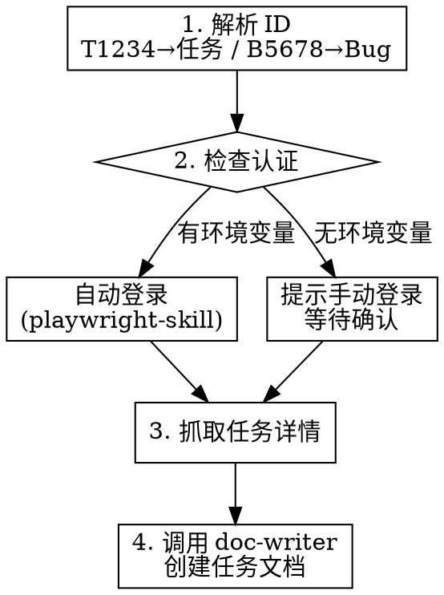

# 禅道任务同步

## Overview

从禅道抓取任务/Bug 详情，自动创建符合规范的任务文档到知识库，确保开发任务可追溯。

## When to Use

- 执行 `/zentao-sync T1234` 同步任务
- 执行 `/zentao-sync B5678` 同步 Bug
- 需要将禅道任务导入知识库开始开发时

## Quick Reference

**ID 格式：**

| 输入 | 类型 | URL 路径 |
|------|------|----------|
| T1234 | 任务 | task-view-1234.html |
| B5678 | Bug | bug-view-5678.html |

**禅道地址：** `https://chandao.bytenew.com/zentao/`

**输出位置：** `~/workspace/Knowledge-Library/02-Tasks/yyyyMMdd-{ID}-{标题}.md`

## 执行流程

## 认证配置

| 环境变量 | 说明 |
|----------|------|
| `ZENTAO_USER` | 禅道用户名 |
| `ZENTAO_PASSWORD` | 禅道密码 |

未配置时：打开浏览器 → 提示手动登录 → 等待用户确认

## 抓取字段

标题、类型、优先级、预计工时、描述、指派人、所属项目、相关需求、关联Bug

**注意**：CSS 选择器需根据实际页面调整，首次使用先截图分析页面结构。

## 错误处理

| 场景 | 处理 |
|------|------|
| 环境变量未配置 | 提示手动登录 |
| 登录失败 | 提示检查账号密码 |
| 任务不存在 | 提示检查 ID |
| 网络超时 | 提示检查网络 |
| 页面结构变化 | 提示截图分析 |

## Common Mistakes

| 错误 | 正确 |
|------|------|
| 输入 `1234` | 输入 `T1234`（需要 T/B 前缀） |
| 输入 `t1234` | 输入 `T1234`（前缀大写） |
| 未登录就抓取 | 先确认登录成功 |
| 手动创建文档 | 使用本 skill 自动创建 |

## 依赖

**REQUIRED SUB-SKILL:** Use `playwright-skill` for browser automation and Zentao login

**REQUIRED SUB-SKILL:** Use `doc-writer` for document creation with task template
